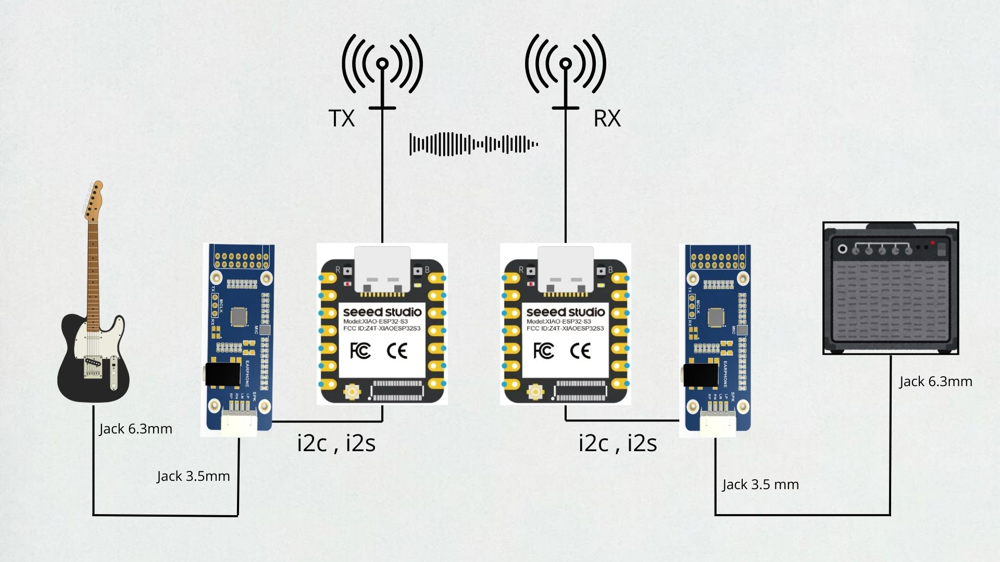

# Wireless guitar system

This repository includes code and documentation of the Wireless guitar system project built using Seed Xiao ESP32-S3 module and WM8960 codec and programmed in ArduinoIDE. The project is still in development (the project is planned to be rewritten in ESP-IDF to improve performance and minimize delay).

## Schematic diagram

## Catalogs structure

- *Esp32s3_testing and EspWroom32_testing* - contains projects that were used in testing codec configuration, i2s communication
- *SparkFun_WM8960_Arduino_Library* - library used in codec configuration
- *Wireless_audio_transmittion* - contains current versions of the projects for the transmitter and the receiver
- *Docs* - contains documentation and other documents
