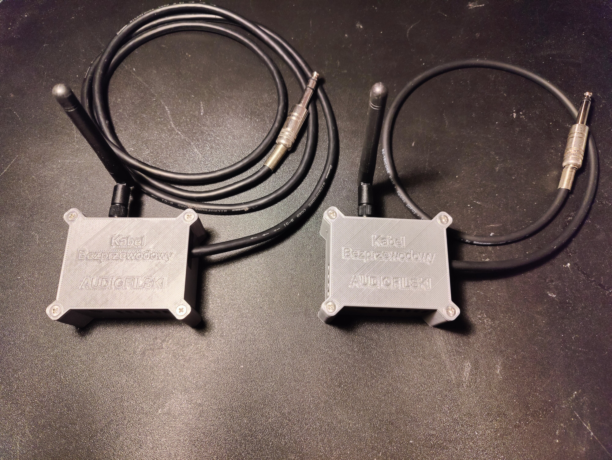

# WGS — Wireless Guitar System

Low-latency wireless audio link for electric guitars, built with two ESP32-S3 microcontrollers. The transmitter captures the guitar signal, compresses it with the LC3 codec, and sends it over ESP-NOW. The receiver decodes the stream and outputs it to an amplifier — all within ~30 ms end-to-end latency.


## How It Works

The system consists of a **transmitter (TX)** and a **receiver (RX)**, each built around an ESP32-S3 and a WM8960 audio codec. The signal chain is:

**Guitar → WM8960 ADC → I2S → ESP32-S3 (LC3 encode) → ESP-NOW → ESP32-S3 (LC3 decode) → I2S → WM8960 DAC → Amplifier**

Both units are housed in 3D-printed enclosures:



## Key Specifications

| Parameter | Value |
|---|---|
| Sample rate | 48 kHz |
| Bit depth | 16-bit |
| Codec | LC3 (Bluetooth LE Audio standard) |
| Frame duration | 2.5 ms (120 samples/frame) |
| Bitrate | 128 kbps |
| Wireless protocol | ESP-NOW (802.11g, 36 Mbps) |
| End-to-end latency | ~30 ms |
| Channel | Mono (right channel from stereo codec) |

## Project Structure

```
src/
├── tx_lc3/          # Transmitter firmware
│   ├── main/
│   │   ├── main.c           # Audio capture, LC3 encoding, ESP-NOW transmission
│   │   └── Setup_codec.cpp  # WM8960 codec initialization
│   └── components/
│       ├── Codec_lib/       # WM8960 I2C driver
│       └── liblc3/          # LC3 encoder/decoder (Google implementation)
│
└── rx_lc3/          # Receiver firmware
    ├── main/
    │   ├── main.c           # ESP-NOW reception, LC3 decoding, I2S playback
    │   └── Setup_codec.cpp  # WM8960 codec initialization
    └── components/
        ├── Codec_lib/       # WM8960 I2C driver
        └── liblc3/          # LC3 encoder/decoder
```

## Building

Requires [ESP-IDF](https://docs.espressif.com/projects/esp-idf/en/stable/esp32s3/get-started/) (tested with ESP-IDF v5.x).

```bash
# Build and flash the transmitter
cd src/tx_lc3
idf.py set-target esp32s3
idf.py build
idf.py -p COMx flash monitor

# Build and flash the receiver
cd src/rx_lc3
idf.py set-target esp32s3
idf.py build
idf.py -p COMx flash monitor
```

### Configuration

Before building, set the **receiver's MAC address** in `src/tx_lc3/main/main.c` (line 46):

```c
static uint8_t receiver_mac[ESP_NOW_ETH_ALEN] = { 0x80, 0xB5, 0x4E, 0xF3, 0xB2, 0x88 };
```

You can read the MAC address of your receiver board from the serial monitor output during boot.

## Pin Configuration

| Function | Pin | Description |
|---|---|---|
| I2S BCLK | GPIO 4 | Bit clock |
| I2S LRCK | GPIO 3 | Left/right word select |
| I2S Data | GPIO 2 | DIN on TX, DOUT on RX |
| I2C SDA | GPIO 5 | Codec control data |
| I2C SCL | GPIO 6 | Codec control clock |

Both TX and RX use the same pinout.

## Design Highlights

- **LC3 compression** — Bluetooth LE Audio codec provides high audio quality at 128 kbps, keeping each wireless frame at just 40 bytes
- **Packet Loss Concealment** — lost frames are reconstructed by the LC3 decoder's built-in PLC algorithm rather than retransmitted, preserving real-time playback
- **Zero dynamic allocation** — all audio buffers, codec memory, and packet pools are statically allocated to guarantee deterministic performance
- **Dual-core pipeline** — encoding/decoding and wireless transmission are distributed across both ESP32-S3 cores to minimize latency
- **CRC-16 validation** — every packet is integrity-checked; corrupted frames are dropped and handled by PLC
